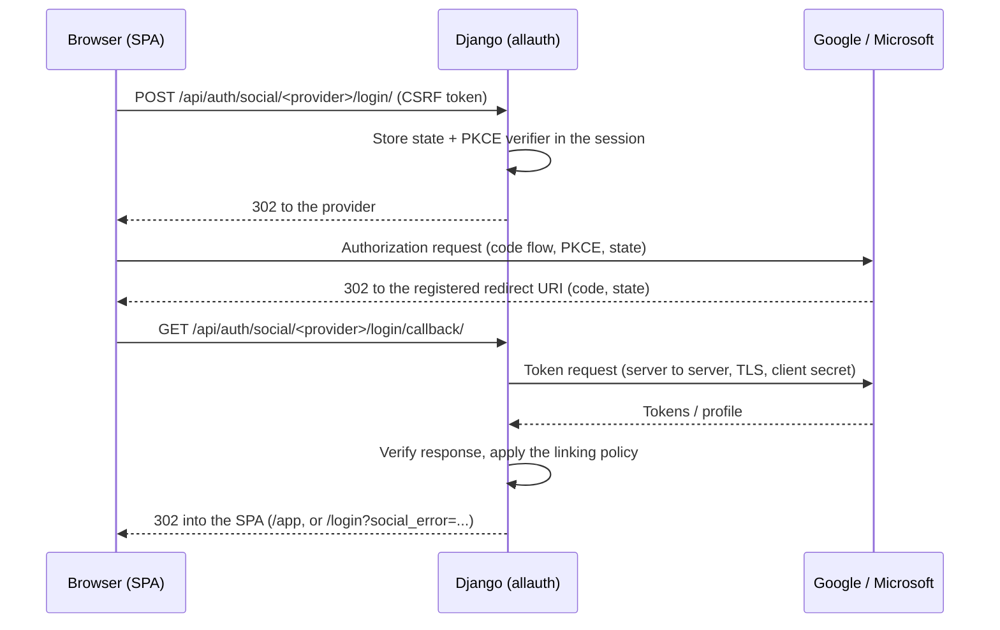

# Social Login (Google & Microsoft)

Users can sign in to OpenFarmPlanner with Google, with Microsoft, or with
the existing email/password login. This document explains how the flow is
built, why account linking works the way it does, and what has to be
configured at Google and Microsoft to switch it on.

## Architecture decision

The provider handshake is implemented with
**[django-allauth](https://docs.allauth.org/)** (`allauth.socialaccount`),
not with hand-written OAuth code. allauth is the established Django
solution for this problem and already implements everything the flow needs
and would be risky to reimplement: authorization code flow, PKCE, `state`
handling, ID-token verification (`iss`, `aud`, `exp`, signature via JWKS),
and a `SocialAccount` model that keys an external identity by
provider + stable provider id.

What OpenFarmPlanner keeps for itself:

- **Session authentication stays as it is.** allauth ends a successful
  handshake with `django.contrib.auth.login()`, i.e. the same session
  cookie the password login has always used. No tokens, no second auth
  scheme, no change to how the SPA talks to the API.
- **Account state stays in `accounts`.** Registration, activation,
  password reset, email change, consent, deletion, and data export are
  unchanged and still owned by the existing views and models.
- **allauth's own UI is not routed.** `allauth.account` is installed
  because `allauth.socialaccount` depends on it, but only its models are
  used. Its signup/login/email pages, its emails, and its error templates
  are never reachable — every outcome is a redirect back into the SPA.
- **The account-linking policy is ours** (`accounts/social_linking.py`),
  because allauth's built-in email-based linking is more permissive than
  what is safe for this application (see below).

`AUTHENTICATION_BACKENDS` deliberately keeps only Django's `ModelBackend`.
allauth falls back to it when its own backend is not installed, and this
keeps the existing `login(request, user)` calls in `accounts` working
unchanged.

### Relevant modules

| File | Purpose |
|---|---|
| `backend/accounts/social_linking.py` | Account-linking policy and error codes |
| `backend/accounts/social_auth.py` | allauth adapters, OAuth2 adapters, SPA redirects |
| `backend/accounts/social_urls.py` | Provider login/callback routes |
| `backend/accounts/social_views.py` | `providers`, `connections`, `disconnect` API |
| `frontend/src/auth/socialAuth.ts` | Starts the handshake, reads the API |
| `frontend/src/components/auth/SocialLoginButtons.tsx` | Buttons on login/register |
| `frontend/src/pages/accountSettingsSocialCard.tsx` | Connect/disconnect in account settings |

## Auth flow



Security properties of that flow:

- **Authorization code flow with PKCE** for both providers; the client
  secret never leaves the server.
- **`state`** is generated and validated by allauth and is bound to the
  Django session. An unknown, replayed, or expired state ends in
  `?social_error=invalid_state`.
- **CSRF**: the handshake can only be *started* with a POST carrying a
  Django CSRF token (`SOCIALACCOUNT_LOGIN_ON_GET = False`), so a third
  party cannot silently start a login through a link or an image. A GET on
  the login endpoint is redirected back to the SPA.
- **Google**: the ID token is verified against Google's JWKS with issuer
  `https://accounts.google.com` and audience = client id, including
  expiry. The `email_verified` claim is read from the same verified token.
  A `nonce` is not used and is not needed: the token is fetched over the
  back channel with the client secret, not through the browser.
- **Microsoft**: allauth's Microsoft provider identifies the user through
  Microsoft Graph `/me`, requested server-to-server over TLS with the
  access token from the code exchange. That direct, TLS-protected channel
  is what makes the response trustworthy — the same reasoning OpenID
  Connect Core §3.1.3.7 applies to skipping ID-token signature checks for
  back-channel responses.
- **Provider tokens are not stored** (`SOCIALACCOUNT_STORE_TOKENS = False`).
  OpenFarmPlanner does not call Google or Microsoft APIs on the user's
  behalf, so nothing needs to outlive the login.
- **Scopes are minimal**: `profile email` for Google, `User.Read` (read
  the signed-in user's own profile) for Microsoft.

Only what the application actually uses is stored: the provider name, the
stable provider user id, the email address, and the given name.

## Account linking

The external identity is always keyed by **provider + stable provider id**
(`sub` for Google, the Graph object id for Microsoft), never by email
alone. Emails only ever decide whether an *existing* local account may be
adopted.

| Situation | Behavior |
|---|---|
| Provider identity already known | Sign in to the linked account |
| No identity, no account with that email, provider verified the email | Create an account, record Terms acceptance |
| No identity, no account with that email, provider did **not** verify the email | Reject with `unverified_email` — see below |
| No identity, account with that email exists | Link only if **both sides verified that mailbox**, otherwise reject with `email_conflict` |
| Provider sent no email | Reject with `missing_email` |
| Account is scheduled for deletion | Reject with `account_pending_deletion` |
| Account exists but is not activated | Reject with `account_inactive` |

"Both sides verified that mailbox" means:

1. the provider asserts a verified address for it, **and**
2. OpenFarmPlanner has its own proof of the same address —
   either an allauth `EmailAddress` record flagged verified, or a usable
   password on an active account (every password account went through the
   emailed activation link, and password reset and email change only ever
   hand over control through a link sent to that address).

In practice that means: **Google can link automatically and create new
accounts; Microsoft can do neither.** Google signs an `email_verified`
claim; Microsoft reports no verification state at all, and for Entra ID
work accounts the address is administrator-controlled — a provider account
with an arbitrary `mail` attribute can be created without ever proving
control of a mailbox. This is the "nOAuth" account-takeover pattern, and it
applies just as much to *creating* a brand-new account as it does to
*linking* to an existing one: an unverified provider email is never trusted
to establish a fresh account for that address either, so a Microsoft login
with no matching local account is rejected (`unverified_email`) rather than
silently signing someone up. The same rule protects any other provider that
might not verify its email claim, not just Microsoft specifically.

A Microsoft user therefore always has to start from an account created some
other way (password registration, or a Google login) and connect Microsoft
explicitly afterward — see the linking flow below.

Whenever automatic linking is refused, the user gets the **explicit linking
flow** instead: sign in with the method you already have, then connect the
provider under *Kontoeinstellungen → Anmeldemethoden*. That path links by
identity, not by email, so one account can carry a password, a Google
identity, and a Microsoft identity at the same time. The last remaining
login method cannot be disconnected; an account without a password sets one
through "Passwort vergessen" first.

### Effect on the existing flows

- **Password login, registration, activation, password reset** are
  unchanged.
- **Activation and confirmed email changes** additionally record the
  address as verified, which is what keeps linking correct after an email
  change.
- **Django's user admin** shows whether the user's current primary email is
  verified, using the existing allauth `EmailAddress` record. allauth stores
  only the boolean verification flag in the version used by this project; no
  verification timestamp is currently available to display.
- **Email change and account deletion** skip the password confirmation for
  accounts that have no usable password — there is nothing to re-enter, and
  the alternative would be that Google/Microsoft users could never delete
  their account. Accounts that do have a password still have to provide it.
- **Password change** still requires the current password; accounts
  without one set an initial password through "Passwort vergessen".
- **Account deletion/anonymization** deletes the linked identities and
  email records along with the rest of the personal data, and the data
  export lists the connected identities.

## Environment variables

| Variable | Required | Meaning |
|---|---|---|
| `GOOGLE_OAUTH_CLIENT_ID` | for Google | OAuth client id |
| `GOOGLE_OAUTH_CLIENT_SECRET` | for Google | OAuth client secret |
| `MICROSOFT_OAUTH_CLIENT_ID` | for Microsoft | Application (client) id |
| `MICROSOFT_OAUTH_CLIENT_SECRET` | for Microsoft | Client secret **value** |
| `MICROSOFT_OAUTH_TENANT` | no | `common` (default), `consumers`, `organizations`, or a tenant id |
| `SOCIAL_AUTH_CALLBACK_BASE_URL` | no | Origin the redirect URIs are built from; defaults to `PUBLIC_FRONTEND_URL` |

A provider without **both** id and secret is simply not offered: the
buttons do not appear and the endpoints redirect back to the login page.
Email/password login is unaffected either way. Secrets belong in
`backend/.env` (git-ignored) and must never be committed.

## Redirect URIs

The redirect URI is `<SOCIAL_AUTH_CALLBACK_BASE_URL>` plus the backend path
of the callback, so it follows the deployment's URL prefix automatically.
Print the exact values for the current configuration with:

```bash
cd backend && pdm run python manage.py show_social_login_config
```

With the default configuration:

| Environment | Redirect URI |
|---|---|
| Development | `http://localhost:5173/api/auth/social/google/login/callback/` |
| Development | `http://localhost:5173/api/auth/social/microsoft/login/callback/` |
| Production | `https://openfarmplanner.org/api/auth/social/google/login/callback/` |
| Production | `https://openfarmplanner.org/api/auth/social/microsoft/login/callback/` |

The callback deliberately points at the **frontend origin**, not directly
at Django: the SPA and the API share an origin in production, and in
development the Vite dev server proxies `/api` to Django (see
`frontend/vite.config.ts`). Routing the callback through the same origin
the SPA runs on is what keeps the session cookie usable — a callback on a
different host would set the session cookie for the wrong domain and the
`state` lookup would fail. If a deployment ever serves the API from a
different origin than the SPA, set `SOCIAL_AUTH_CALLBACK_BASE_URL` to the
API origin and add that origin to `CSRF_TRUSTED_ORIGINS`.

## Google setup

1. Open <https://console.cloud.google.com/> and select (or create) a project.
2. **APIs & Services → OAuth consent screen**: choose *External*, fill in
   app name, support email and developer contact, and add the scopes
   `.../auth/userinfo.email`, `.../auth/userinfo.profile` and `openid`.
   No other scopes are needed. Publish the app when you want users outside
   your test list to sign in.
3. **APIs & Services → Credentials → Create credentials → OAuth client ID**,
   application type **Web application**.
4. Authorized JavaScript origins: `http://localhost:5173` (development) and
   `https://openfarmplanner.org` (production).
5. Authorized redirect URIs: the two Google URIs from the table above.
6. Copy the client id and client secret into `GOOGLE_OAUTH_CLIENT_ID` and
   `GOOGLE_OAUTH_CLIENT_SECRET`.

## Microsoft setup

OpenFarmPlanner is a public web application, so the app registration uses
the **`common`** tenant: it accepts both personal Microsoft accounts
(outlook.com, hotmail.com, …) and Microsoft 365 / Entra ID work and school
accounts. Restricting to `consumers` would lock out farms that use
Microsoft 365, and restricting to `organizations` would lock out private
users; neither fits a public tool. The tenant is configurable through
`MICROSOFT_OAUTH_TENANT` for deployments with different needs.

Because a `common` registration accepts work accounts whose email address
is set by their tenant administrator, Microsoft addresses are treated as
unverified for account linking (see above). That is a deliberate trade-off:
broad account support, strict linking.

1. Open <https://entra.microsoft.com/> → **App registrations → New registration**.
2. Name it (e.g. `OpenFarmPlanner`) and choose supported account types
   **"Accounts in any organizational directory and personal Microsoft
   accounts"** (that is the `common` tenant).
3. Redirect URI: platform **Web**, value = the production Microsoft URI
   from the table above. Add the `http://localhost:5173` one as a second
   Web redirect URI for development (Entra allows plain HTTP only for
   localhost).
4. **Certificates & secrets → New client secret**: copy the secret
   **value** (not the id) immediately, it is only shown once.
5. **API permissions**: `Microsoft Graph → Delegated → User.Read` is
   enough. Nothing else is requested, and no admin consent is required.
6. Copy the Application (client) id and the secret value into
   `MICROSOFT_OAUTH_CLIENT_ID` and `MICROSOFT_OAUTH_CLIENT_SECRET`.

Client secrets in Entra expire (24 months at most). Note the expiry date —
when the secret expires, social login stops working with
`?social_error=invalid_response` until a new secret is deployed.

## Local development

```bash
cd backend
cp .env.example .env          # then fill in the OAuth variables
pdm install
pdm run migrate               # creates the allauth tables
pdm run runserver
```

Start the frontend as usual (`npm run dev`) and open the app through
`http://localhost:5173` — not through `127.0.0.1:5173`, because the
redirect URIs registered at the providers are host-specific.

Without OAuth credentials nothing breaks: the buttons are simply not
rendered, and the rest of the login page is unchanged.

## Production (Uberspace)

1. Add the four (or two) OAuth variables to `backend/.env` on the server.
2. Set `SOCIAL_AUTH_CALLBACK_BASE_URL` only if the API is *not* served from
   `PUBLIC_FRONTEND_URL`.
3. Run the migrations (`pdm run migrate`) — allauth adds its own tables.
4. Restart the backend service.

No cookie, CORS, or CSRF settings need to change: the whole flow runs on
the existing origin with the existing session cookie
(`SESSION_COOKIE_SAMESITE=Lax`, `Secure` in production). `Lax` is
sufficient because the provider returns through a top-level GET
navigation, which still carries the cookie.

## Manual checklist after the merge

- [ ] Create the Google OAuth client (consent screen, web client, redirect
      URIs for localhost and production).
- [ ] Create the Entra ID app registration (`common` tenant, web redirect
      URIs, client secret, `User.Read`).
- [ ] Put `GOOGLE_OAUTH_CLIENT_ID`, `GOOGLE_OAUTH_CLIENT_SECRET`,
      `MICROSOFT_OAUTH_CLIENT_ID`, `MICROSOFT_OAUTH_CLIENT_SECRET` into
      `backend/.env` locally and on the server (never into git).
- [ ] Run `pdm run migrate` on the server.
- [ ] Verify the redirect URIs with
      `pdm run python manage.py show_social_login_config`.
- [ ] Restart the backend and check that both buttons appear on `/login`.
- [ ] Sign in once with Google and once with Microsoft, and confirm that
      the existing password login still works.
- [ ] Note the Entra client secret expiry date.
